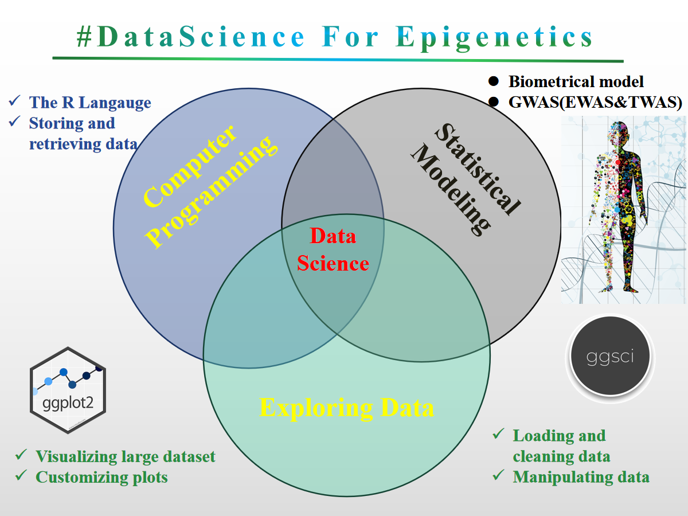
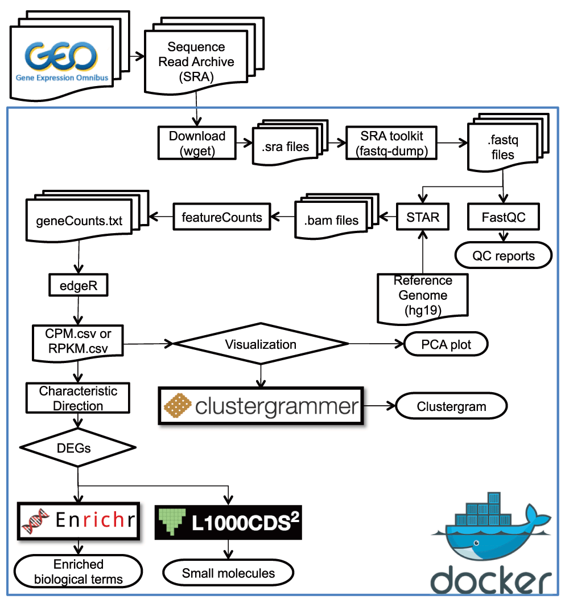
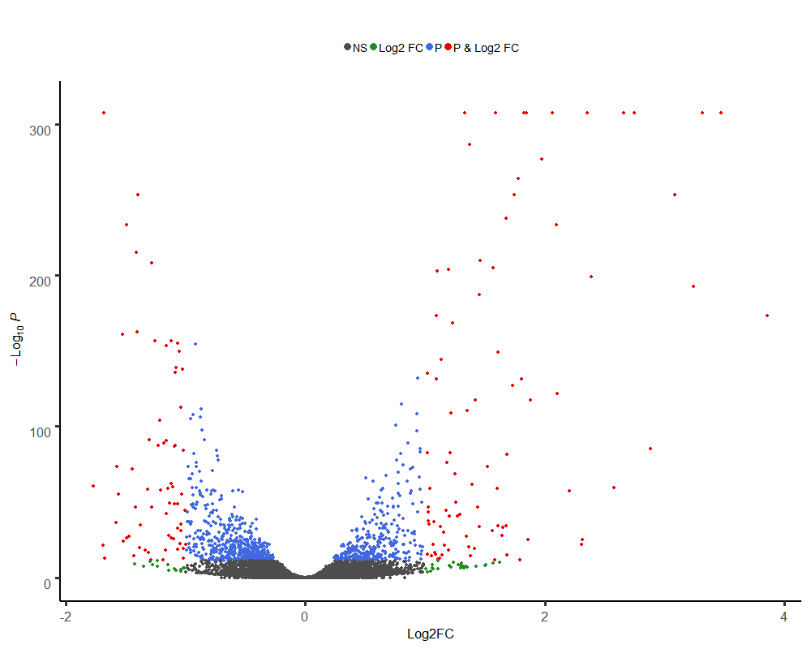
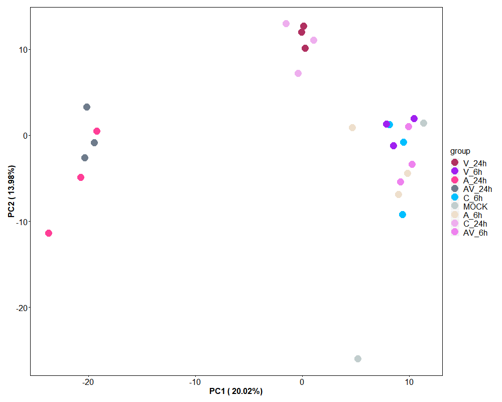
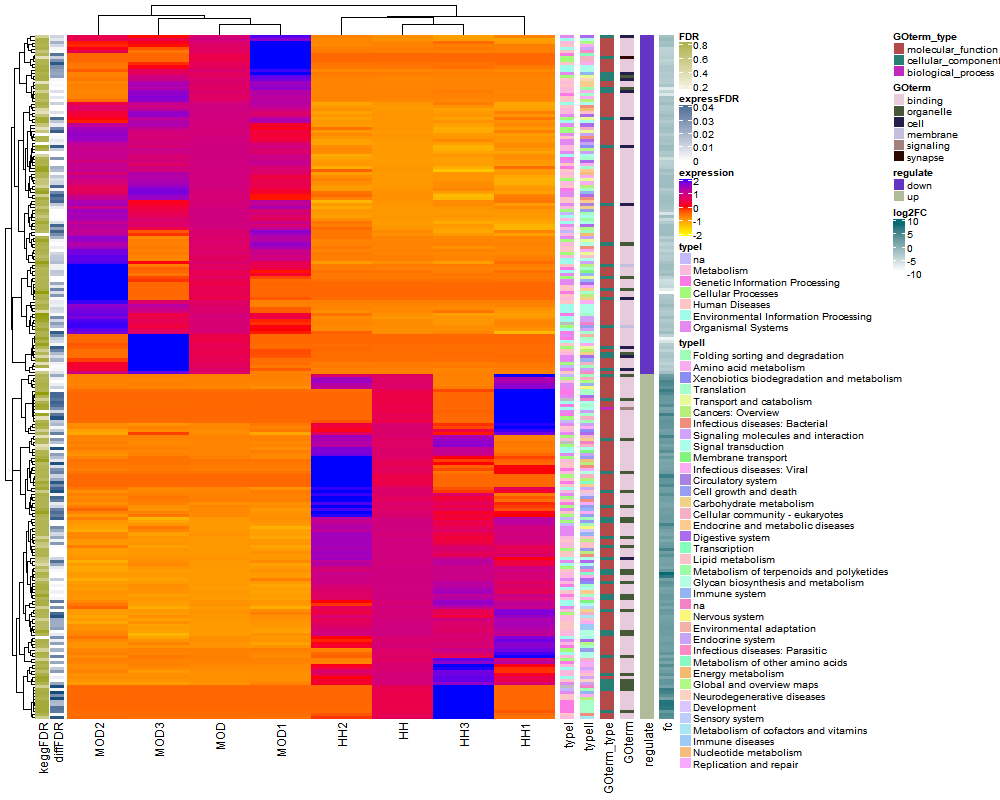
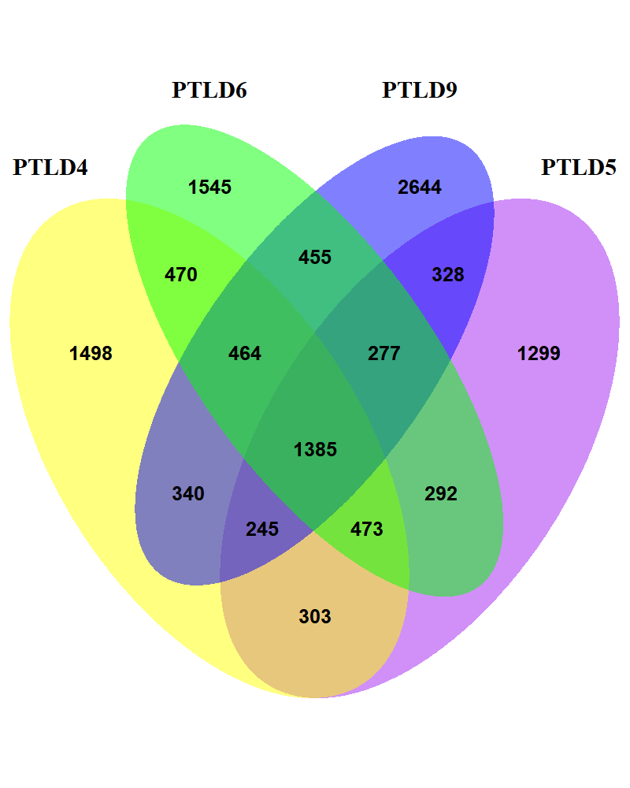
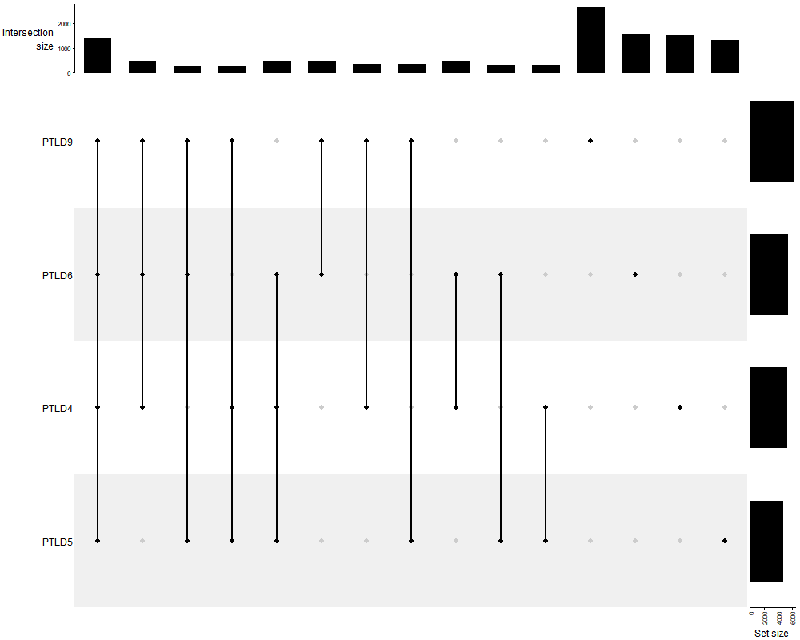
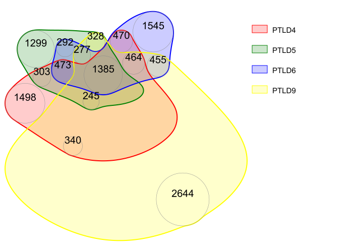

###  WORKSHOP Overview <a href="Fig/outline.png"></a>

### Big Data and Data Science using R for researchers 
 This is a short course for Rstat, Rdataviz and Bioinformatics. Mainly is designed to provide a good opportunity for researchers to learn R (An interactive approach to statistical computing) and Bioinformatics for Fun (LOL). Specifically designed for data analysis and graphics (ggplot2) and the visual analysis of the results related to [transcriptome analysis Pipeline](https://www.google.com/url?sa=i&rct=j&q=&esrc=s&source=images&cd=&ved=2ahUKEwjMg_Syq83iAhUSxoUKHRMjCnYQjRx6BAgBEAU&url=https%3A%2F%2Ff1000research.com%2Farticles%2F5-1574%2Fv1&psig=AOvVaw1Bpok3S24JvtZOHf2f6x6I&ust=1559652127627069) (volcano plot, bubble plot, complex heatmap (GO enrichment Set analysis, KEGG analysis (pathsway analysis)) and venn graph (SuperVenn)). Statistical genomics (biometric models) to be included in later courses (eg: GWAS (EWAS and TWAS)). Another is taking you into learn how to running transcriptome analysis Pipeline for your own sequence data. Hope to Look forward to meeting you at majorbio in shanghai this month. 
### Location
 
<div align="center"><iframe src="https://www.google.com/maps/embed?pb=!1m18!1m12!1m3!1d3416.2558021437867!2d121.62565031548901!3d31.102621574761713!2m3!1f0!2f0!3f0!3m2!1i1024!2i768!4f13.1!3m3!1m2!1s0x35b278a7530eb1dd%3A0xb40b78f5079ac68b!2sCentury+Medicine+Park!5e0!3m2!1sen!2sus!4v1531624183346" width="600" height="450" frameborder="0" style="border:0" allowfullscreen></iframe></div>


### Schedule

| Topic | Time | Day|
| :---: | :---: | :---: |
| Introduction to Linux/Perl for bioinformatics | 08:30 - 12:00 | 06.13
| Data Science visualization (R DataViz) | 13:30 - 17:30 | 06.13
| Transcriptome analysis procedure I (QC, Assembly(noref), Mapping and RSEM) | 08:30 - 12:00 | 06.14
| Transcriptome analysis procedure II (DE (edgeR), PCA and (GO, KEGG) set analysis)  | 13:30 - 17:30 | 06.14

### Pipeline (Reference)

<div align="center"><a href="https://f1000research.com/articles/5-1574/v1"></a></div>

### Contact Me:
> [meng.luo@majorbio.com](Meng Luo) OR [czheluo@gmail.com](Chenzhe Luo) 

# Installation
 
**Required packages** can be installed on Windows, Linux and MacOS(NO TRAYING) with following steps:

**installation for newest R packages**
Required packages can be installed with following R codes for Windows:  
```r
>source(install_packages.R)
## Offline installation
>sourceInstall(path = setwd()) # the PATH WAS THE PACKAGES LOACATION
## online installation
>sourceInstall(win = T, packages = T) # Recommended
```
Required packages can be installed with following R codes for Linux:  
```r
>source(install_packages.R)
## Offline installation
>sourceInstall(path = setwd()) # The PATH WAS THE PACKAGES LOACATION
## online installation
>sourceInstall(linux = T, packages = T) # Recommended
```

## Some examples

### volcano plot
```r
load("expres.rds")
png(paste("human.vol",".png",sep=""),width=1000, height=800)
EnhancedVolcano(expres,lab = rownames(expres),
                x= 'log2fc',
                y= 'padjust',
                selectLab="",
                title = "",
                pCutoff = 10e-12,
                FCcutoff = 1,
                xlab = "Log2FC",
                transcriptPointSize = 1.5,
                transcriptLabSize = 3.0,
                colAlpha = 1,
                cutoffLineType = 'blank',
                cutoffLineCol = 'black',
                cutoffLineWidth =1,
                legendLabSize = 14, 
                legendIconSize = 4,
                transcriptPointSize =2, #c(1.6,1.6,1.6,1.6), 
                transcriptLabSize = 3, #c(4,4,4,4), 
                gridlines.major = FALSE,
                gridlines.minor = FALSE)
dev.off()
```


## PCA
```r
load("expres.rds")
human.pca <- prcomp(as.matrix(t(pca[, c(2:27)])), scale = T)
human.pca.out <- as.data.frame(human.pca$x)
human.pca.out$group <- gro[, 1]
head(human.pca.out)
p <- ggplot(human.pca.out, aes(x = PC1, y = PC2, color = group))
p <- p + geom_point()
p
p <- ggplot(human.pca.out, aes(x = PC1, y = PC2, color = group))
p <- p + geom_point() + theme
p
# add label text
p <- ggplot(human.pca.out, aes(x = PC1, y = PC2, color = group, label = row.names(human.pca.out)))
p <- p + geom_point() + geom_text(size = 3) + theme
p
percentage <- round(human.pca$sdev / sum(human.pca$sdev) * 100, 2)
percentage <- paste(
  colnames(human.pca.out),
  "(", paste(as.character(percentage), "%", ")", sep = "")
)
p <- ggplot(human.pca.out, aes(x = PC1, y = PC2, color = group))
p <- p + geom_point() + theme + xlab(percentage[1]) + ylab(percentage[2])
p
# change color
human.pca.out$group <- factor(human.pca.out$group,
  levels = c(
    "V_24h", "V_6h", "A_24h", "AV_24h",
    "C_6h", "MOCK", "A_6h", "C_24h", "AV_6h"
  )
)
p <- ggplot(human.pca.out, aes(x = PC1, y = PC2, color = group))
p <- p + geom_point() + theme + xlab(percentage[1]) + ylab(percentage[2]) +
  scale_color_manual(values = rcolor[sample(1:9)])
p

```


## complexheatmap
```r
png(paste("complexheatmap",".png",sep=""),width=1000, height=800)
Heatmap(mmmat,
        name = "expression", col = colorRamp2(c(-2, 0, 2), c("yellow", "red", "blue")),
        show_row_names = FALSE, show_column_names = TRUE,
        left_annotation = kegg
) +
  rowAnnotation(typeI = mrna$typeI) +
  Heatmap(mrna$typeII, name = "typeII", width = unit(5, "mm")) +
  rowAnnotation(GOterm_type = mrna$goTerm_type) +
  rowAnnotation(GOterm = mrna$goTerm) +
  rowAnnotation(regulate = mrna$regulate) +
  HeatmapAnnotation(fc = mrna$log2FC.HH.MOD., annotation_legend_param = list(title = "log2FC"), which = "row")

dev.off()
```


## Supervenn
```r

library(VennDiagram)
venn.diagram(
  x = list(
    PTLD4 = v1$circbase_ID, PTLD5 = v2$circbase_ID,
    PTLD6 = v3$circbase_ID, PTLD9 = v4$circbase_ID
  ),
  category.names = c("PTLD4", "PTLD5", "PTLD6", "PTLD9"),
  filename = "4_venn_diagramm.png",
  output = TRUE,
  imagetype = "png",
  height = 1000,
  width = 800,
  resolution = 300,
  compression = "lzw",
  lwd = 1,
  lty = "blank",
  fill = c("yellow", "purple", "green", "blue"),
  cex = 0.5,
  fontface = "bold",
  fontfamily = "sans",
  cat.cex = 0.6,
  cat.fontface = "bold",
  cat.default.pos = "outer"
)
#uPset venn
library(ComplexHeatmap)
png(paste("upset",".png",sep=""),width=1000, height=800)
lt <- list(
  PTLD4 = v1$circbase_ID, PTLD5 = v2$circbase_ID,
  PTLD6 = v3$circbase_ID, PTLD9 = v4$circbase_ID
)
m <- make_comb_mat(lt)
UpSet(m)
dev.off()

## nVennR

myV4 <- plotVenn(list(PTLD4 = v1$circbase_ID, PTLD5 = v2$circbase_ID, PTLD6 = v3$circbase_ID, PTLD9 = v4$circbase_ID),
  nCycles = 2000, setColors = c("red", "green", "blue", "yellow"),
  labelRegions = F, fontScale = 2, opacity = 0.2, borderWidth = 2, outFile = "mnVR.svg"
)

showSVG(myV4, opacity = 0.8, systemShow = T)


```




