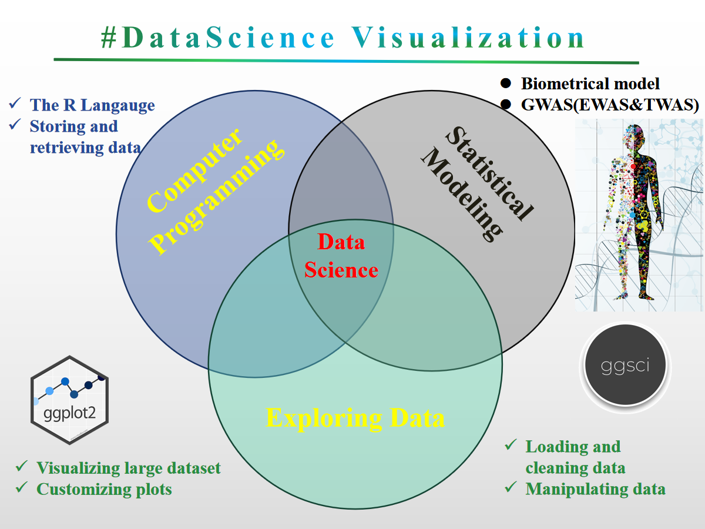
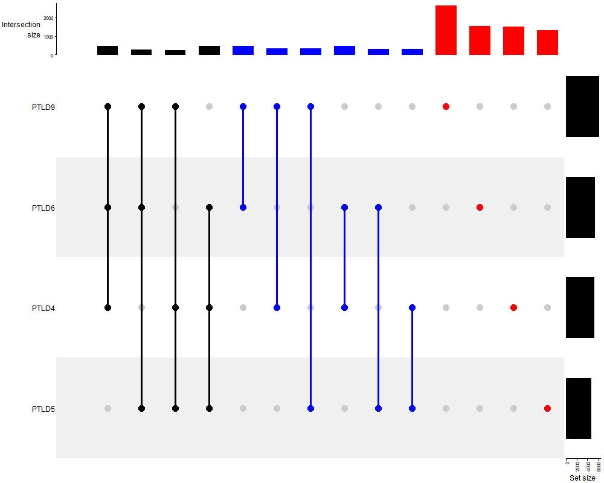

###  WORKSHOP Overview <a href="Fig/outline.png"></a>

 This is a short course for Rstat, Rdataviz and Bioinformatics. Mainly is designed to provide a good opportunity for researchers to learn R (An interactive approach to statistical computing) and Bioinformatics for Fun (LOL). Specifically designed for data analysis and graphics (ggplot2) and the visual analysis of the results related to [transcriptome analysis Pipeline](https://www.google.com/url?sa=i&rct=j&q=&esrc=s&source=images&cd=&ved=2ahUKEwjMg_Syq83iAhUSxoUKHRMjCnYQjRx6BAgBEAU&url=https%3A%2F%2Ff1000research.com%2Farticles%2F5-1574%2Fv1&psig=AOvVaw1Bpok3S24JvtZOHf2f6x6I&ust=1559652127627069) (volcano plot, bubble plot, complex heatmap (GO enrichment Set analysis, KEGG analysis (pathsway analysis)) and venn graph (SuperVenn)). Statistical genomics (biometric models) to be included in later courses (eg: GWAS (EWAS and TWAS)). Another is taking you into learn how to running transcriptome analysis Pipeline for your own sequence data. Hope to look forward to meeting you at majorbio in shanghai this month. 
### Location
 
<div align="center"><iframe src="https://www.google.com/maps/embed?pb=!1m18!1m12!1m3!1d3416.2558021437867!2d121.62565031548901!3d31.102621574761713!2m3!1f0!2f0!3f0!3m2!1i1024!2i768!4f13.1!3m3!1m2!1s0x35b278a7530eb1dd%3A0xb40b78f5079ac68b!2sCentury+Medicine+Park!5e0!3m2!1sen!2sus!4v1531624183346" width="600" height="450" frameborder="0" style="border:0" allowfullscreen></iframe></div>


### Schedule

| Topic | Time | Day|
| :---: | :---: | :---: |
| Introduction to Linux/Perl for bioinformatics | 08:30 - 12:00 | 06.13 && 08.13
| Data Science visualization (R DataViz) | 13:30 - 17:30 | 06.13 && 08.13
| Transcriptome analysis procedure I (QC, Assembly(noref), Mapping and RSEM) | 08:30 - 12:00 | 06.14 && 08.14
| Transcriptome analysis procedure II (DE (edgeR), PCA and (GO, KEGG) set analysis)  | 13:30 - 17:30 | 06.14 && 08.14

### Pipeline (Reference)

<div align="center"><a href="https://f1000research.com/articles/5-1574/v1"></a></div>

### Contact Me:
> [meng.luo@majorbio.com](Meng Luo) OR [czheluo@gmail.com](Chenzhe Luo) 

# Installation
 
**Required packages** can be installed on Windows, Linux and MacOS with following steps:

**installation for newest R packages**
Required packages can be installed with following R codes for Windows:  
```r
>source(install_packages.R)
## Offline installation
>sourceInstall(path = setwd()) # the PATH WAS THE PACKAGES LOACATION
## online installation
>sourceInstall(win = T, packages = T) # Recommended
```
Required packages can be installed with following R codes for Linux:  
```r
>source(install_packages.R)
## Offline installation
>sourceInstall(path = setwd()) # The PATH WAS THE PACKAGES LOACATION
## online installation
>sourceInstall(linux = T, packages = T) # Recommended
```

## Some examples

### MA Plot
```r
# require
library(tidyverse)
library(DESeq2)
library(RColorBrewer)
color <- grDevices::colors()[grep("gr(a|e)y", grDevices::colors(), invert = T)]
rcolor <- color[sample(1:length(color), length(color))]

myWO <- read.csv("WT_KO_count.csv", header = T, row.names = "ensgene")
metWO <- read.csv("WT_KO.csv", header = T, row.names = "name")

all(rownames(metWO) %in% colnames(myWO))

all(rownames(metWO) == colnames(myWO))

dds <- DESeqDataSetFromMatrix(
  countData = myWO,
  colData = metWO,
  design = ~dex
)
dds

dds <- DESeq(dds)

res <- results(dds, tidy = TRUE)
res <- tbl_df(res)
res

# Create the new column
res <- res %>% mutate(sig=padj<0.05)

# How many of each?
res %>% 
  group_by(sig) %>% 
  summarize(n=n())
  
res %>% 
  filter(!is.na(log2FoldChange)) %>% 
  ggplot(aes(baseMean, log2FoldChange, col=sig)) + 
  geom_point() + 
  scale_fill_manual(values = rcolor[c(1:3)])+
  scale_color_manual(values = rcolor[c(1:3)])+
  scale_x_log10() + 
  ggtitle("MA plot")

```


### volcano plot
```r
load("expres.rds")
png(paste("human.vol",".png",sep=""),width=1000, height=800)
EnhancedVolcano(expres,lab = rownames(expres),
                x= 'log2fc',
                y= 'padjust',
                selectLab="",
                title = "",
                pCutoff = 10e-12,
                FCcutoff = 1,
                xlab = "Log2FC",
                transcriptPointSize = 1.5,
                transcriptLabSize = 3.0,
                colAlpha = 1,
                cutoffLineType = 'blank',
                cutoffLineCol = 'black',
                cutoffLineWidth =1,
                legendLabSize = 14, 
                legendIconSize = 4,
                transcriptPointSize =2, #c(1.6,1.6,1.6,1.6), 
                transcriptLabSize = 3, #c(4,4,4,4), 
                gridlines.major = FALSE,
                gridlines.minor = FALSE)
dev.off()
```


## PCA
```r
load("expres.rds")
human.pca <- prcomp(as.matrix(t(pca[, c(2:27)])), scale = T)
human.pca.out <- as.data.frame(human.pca$x)
human.pca.out$group <- gro[, 1]
head(human.pca.out)
p <- ggplot(human.pca.out, aes(x = PC1, y = PC2, color = group))
p <- p + geom_point()
p
p <- ggplot(human.pca.out, aes(x = PC1, y = PC2, color = group))
p <- p + geom_point() + theme
p
# add label text
p <- ggplot(human.pca.out, aes(x = PC1, y = PC2, color = group, label = row.names(human.pca.out)))
p <- p + geom_point() + geom_text(size = 3) + theme
p
percentage <- round(human.pca$sdev / sum(human.pca$sdev) * 100, 2)
percentage <- paste(
  colnames(human.pca.out),
  "(", paste(as.character(percentage), "%", ")", sep = "")
)
p <- ggplot(human.pca.out, aes(x = PC1, y = PC2, color = group))
p <- p + geom_point() + theme + xlab(percentage[1]) + ylab(percentage[2])
p
# change color
human.pca.out$group <- factor(human.pca.out$group,
  levels = c(
    "V_24h", "V_6h", "A_24h", "AV_24h",
    "C_6h", "MOCK", "A_6h", "C_24h", "AV_6h"
  )
)
p <- ggplot(human.pca.out, aes(x = PC1, y = PC2, color = group))
p <- p + geom_point() + theme + xlab(percentage[1]) + ylab(percentage[2]) +
  scale_color_manual(values = rcolor[sample(1:9)])
p

```


## complexheatmap
```r
png(paste("complexheatmap",".png",sep=""),width=1000, height=800)
Heatmap(mmmat,
        name = "expression", col = colorRamp2(c(-2, 0, 2), c("yellow", "red", "blue")),
        show_row_names = FALSE, show_column_names = TRUE,
        left_annotation = kegg
) +
  rowAnnotation(typeI = mrna$typeI) +
  Heatmap(mrna$typeII, name = "typeII", width = unit(5, "mm")) +
  rowAnnotation(GOterm_type = mrna$goTerm_type) +
  rowAnnotation(GOterm = mrna$goTerm) +
  rowAnnotation(regulate = mrna$regulate) +
  HeatmapAnnotation(fc = mrna$log2FC.HH.MOD., annotation_legend_param = list(title = "log2FC"), which = "row")

dev.off()
```


## Circos

```r
load("mlm.rds")
mlm <- is.na(mlm)
circos.par("track.height" = 0.2)
circos.initialize(factors = mlm$SNP, x = mlm$BP / 1000000)
circos.track(
  factors = mlm$SNP, y = mlm$effect,
  panel.fun = function(x, y) {
    circos.text(
      CELL_META$xcenter, CELL_META$cell.ylim[2] + uy(5, "mm"),
      CELL_META$sector.index
    )
    circos.axis(labels.cex = 0.6)
  }
)

circos.trackPoints(mlm$SNP, mlm$BP / 1000000, mlm$effect, col = rcolor[1:7], pch = 19, cex = 0.5)

## heatmap

circos.track(ylim = c(-7.998938, 3.869004), panel.fun = function(x, y) {
  xlim <- CELL_META$xlim
  ylim <- CELL_META$ylim
  breaks <- seq(xlim[1], xlim[2], by = 1)
  n_breaks <- length(breaks)
  circos.rect(breaks[-n_breaks], rep(ylim[1], n_breaks - 1),
    breaks[-1], rep(ylim[2], n_breaks - 1),
    col = rand_color(n_breaks), border = NA
  )
})

## link (three link type)
chr1 <- mlm[which(mlm$SNP %in% "chr1"), 3][1:20]
chr6 <- mlm[which(mlm$SNP %in% "chr6"), 3][1:20]
chr2 <- mlm[which(mlm$SNP %in% "chr2"), 3][1:20]
chr7 <- mlm[which(mlm$SNP %in% "chr7"), 3][1:20]
chr4 <- mlm[which(mlm$SNP %in% "chr4"), 3][1:20]
chr5 <- mlm[which(mlm$SNP %in% "chr5"), 3][1:20]
chr3 <- mlm[which(mlm$SNP %in% "chr3"), 3][1:20]
for (i in 1:7) {
  circos.link("chr1", chr1[i], "chr6", chr6[i],
    col = rcolor[which(unique(mlm$SNP) %in% "chr6")],
    h = 0.4
  )
  circos.link("chr2", chr2[i], "chr7", chr7[i],
    col = rcolor[which(unique(mlm$SNP) %in% "chr7")],
    h = 0.5
  )
  circos.link("chr4", chr4[i], "chr5", chr5[i],
    col = rcolor[which(unique(mlm$SNP) %in% "chr5")],
    h = 0.5
  )
  circos.link("chr3", chr3[i], "chr4", chr4[i],
    col = rcolor[which(unique(mlm$SNP) %in% "chr4")],
    h = 0.5
  )
  circos.link("chr2", chr2[i], "chr5", chr4[i],
    col = rcolor[which(unique(mlm$SNP) %in% "chr4")],
    h = 0.5
  )
}
```


## Supervenn
```r

library(VennDiagram)
venn.diagram(
  x = list(
    PTLD4 = v1$circbase_ID, PTLD5 = v2$circbase_ID,
    PTLD6 = v3$circbase_ID, PTLD9 = v4$circbase_ID
  ),
  category.names = c("PTLD4", "PTLD5", "PTLD6", "PTLD9"),
  filename = "4_venn_diagramm.png",
  output = TRUE,
  imagetype = "png",
  height = 1000,
  width = 800,
  resolution = 300,
  compression = "lzw",
  lwd = 1,
  lty = "blank",
  fill = c("yellow", "purple", "green", "blue"),
  cex = 0.5,
  fontface = "bold",
  fontfamily = "sans",
  cat.cex = 0.6,
  cat.fontface = "bold",
  cat.default.pos = "outer"
)
#uPset venn
library(ComplexHeatmap)
png(paste("upset",".png",sep=""),width=1000, height=800)
lt <- list(
  PTLD4 = v1$circbase_ID, PTLD5 = v2$circbase_ID,
  PTLD6 = v3$circbase_ID, PTLD9 = v4$circbase_ID
)
m <- make_comb_mat(lt)
UpSet(m)
dev.off()

## nVennR

myV4 <- plotVenn(list(PTLD4 = v1$circbase_ID, PTLD5 = v2$circbase_ID, PTLD6 = v3$circbase_ID, PTLD9 = v4$circbase_ID),
  nCycles = 2000, setColors = c("red", "green", "blue", "yellow"),
  labelRegions = F, fontScale = 2, opacity = 0.2, borderWidth = 2, outFile = "mnVR.svg"
)

showSVG(myV4, opacity = 0.8, systemShow = T)


```




## Network
```r
# load packages
library(vegan)
library(igraph)
library(Hmisc)

coRnetwork <- function(matrix, cor.cutoff, p.cutoff) {
  # load packages
  library(vegan)
  library(igraph)
  library(Hmisc)
  
  matrix1 <- matrix
  matrix1[matrix1 > 0] <- 1

  # correlation analysis based on spearman's or pearson co-efficient
  matrix.dist <- rcorr(t(matrix), type = "spearman")
  # matrix.dist<-rcorr(t(matrix),type="pearson")
  matrix.cor <- matrix.dist$r
  matrix.cor.p <- matrix.dist$P


  # Multiple testing correction using Benjamini-Hochberg standard false discovery rate correction
  matrix.cor.p <- p.adjust(matrix.cor.p, method = "BH")

  # Consider positive cooccurence at given coefficient (cor.cutoff) and p-value cutoffs
  matrix.cor1 <- matrix.cor
  matrix.cor1.p <- matrix.cor.p
  matrix.cor1[which(matrix.cor1 <= cor.cutoff)] <- 0
  matrix.cor1[which(matrix.cor1.p > p.cutoff)] <- 0
  # delete those rows and columns with sum = 0
  matrix.cor1 <- matrix.cor1[which(rowSums(matrix.cor1) != 1), ]
  matrix.cor1 <- matrix.cor1[, which(colSums(matrix.cor1) != 0)]

  # Consider netagive cooccurence at given coefficient (-cor.cutoff) and p-value cutoffs
  matrix.cor2 <- matrix.cor
  matrix.cor2.p <- matrix.cor.p
  matrix.cor2[which(matrix.cor2 > (-cor.cutoff))] <- 0
  matrix.cor2[which(matrix.cor2.p > p.cutoff)] <- 0
  # delete those rows and columns with sum = 0
  matrix.cor2 <- matrix.cor2[which(rowSums(matrix.cor2) != 0), ]
  matrix.cor2 <- matrix.cor2[, which(colSums(matrix.cor2) != 0)]

  # Consider both positive and netagive cooccurence at given coefficient (cor.cutoff) and p-value cutoffs
  matrix.cor3 <- matrix.cor
  matrix.cor3.p <- matrix.cor.p
  matrix.cor3[which(matrix.cor3 >= (-cor.cutoff) & matrix.cor3 <= cor.cutoff)] <- 0
  matrix.cor3[which(matrix.cor3.p > p.cutoff)] <- 0

  # delete those rows and columns with sum = 0
  matrix.cor3 <- matrix.cor3[which(rowSums(matrix.cor3) != 1), ]
  matrix.cor3 <- matrix.cor3[, which(colSums(matrix.cor3) != 0)]

  # get pairs r
  # This is to remove redundancy as upper correlation matrix == lower
  ma1 <- matrix.cor1
  ma2 <- matrix.cor2
  ma3 <- matrix.cor3
  ma1[upper.tri(matrix.cor1, diag = TRUE)] <- NA
  pair.r1 <- reshape2::melt(ma1, na.rm = TRUE, value.name = "cor")
  ma2[upper.tri(ma2, diag = TRUE)] <- NA
  pair.r2 <- reshape2::melt(ma2, na.rm = TRUE, value.name = "cor")
  ma3[upper.tri(ma3, diag = TRUE)] <- NA
  pair.r3 <- reshape2::melt(ma3, na.rm = TRUE, value.name = "cor")
  pair.r1<-pair.r1[which(pair.r1[,3]!=0),]
  pair.r2<-pair.r2[which(pair.r2[,3]!=0),]
  pair.r3<-pair.r3[which(pair.r3[,3]!=0),]
  write.csv(pair.r1, file = "Pos_otu.csv",quote = F, row.names = F)
  write.csv(pair.r2, file = "Neg_otu.csv",quote = F,row.names = F)
  write.csv(pair.r3, file = "PosNeg_otu.csv",quote = F,row.names = F)

  # generating graph using igraph
  g1 <- graph.adjacency(matrix.cor1, weight = T, mode = "undirected")
  g1 <- simplify(g1)
  V(g1)$label <- V(g1)$name
  V(g1)$degree <- degree(g1)

  g2 <- graph.adjacency(matrix.cor2, weight = T, mode = "undirected")
  g2 <- simplify(g2)
  V(g2)$label <- V(g2)$name
  V(g2)$degree <- degree(g2)

  g3 <- graph.adjacency(matrix.cor3, weight = T, mode = "undirected")
  g3 <- simplify(g3)
  V(g3)$label <- V(g3)$name
  V(g3)$degree <- degree(g3)

  # append the output into results
  result <- list()
  result$matrix.cor <- matrix.cor
  result$matrix.cor.p <- matrix.cor.p

  result$matrix.cor1 <- matrix.cor1
  result$graph1 <- g1

  result$matrix.cor2 <- matrix.cor2
  result$graph2 <- g2

  result$matrix.cor3 <- matrix.cor3
  result$graph3 <- g3
  return(result)
}

#install.packages("gtools")
library(gtools)
f <- foldchange(Abu[,1],Abu[,14])
cbind(Abu[,1],Abu[,14],a,b,f)

# Co-occurrence-network-analysis
## OTU filtering, network generation, topological analysis and export OTU table
library(igraph)
library(Hmisc)

setwd("director/path")

Abu <- read.table("oturelative.txt", header = T)
Abu <- read.table("otuabu.txt", header = T)
Abu <- as.matrix(Abu)

### Filtering OTUs
table <- Abu
table[table > 0] <- 1
table.generalist <- Abu[which(rowSums(table) >= 12), ]
Abu <- table.generalist

## Creating gml files of network (to be visulized in Gephi or Cytoscape)

## cutoffs for correlation coefficient and P-value
pattern <- coRnetwork(Abu, 0.6, 0.01)

#write.graph(pattern$graph1, "Pos0.6-rela.gml", format = "gml") # network file for positive association
#write.graph(pattern$graph2, "Neg0.6-rela.gml", format = "gml") # network file for negative association
#write.graph(pattern$graph3, "PosNeg0.6-rela.gml", format = "gml") # network file for all association

write.graph(pattern$graph1, "Pos0.6-abu.gml", format = "gml") # network file for positive association
write.graph(pattern$graph2, "Neg0.6-abu.gml", format = "gml") # network file for negative association
write.graph(pattern$graph3, "PosNeg0.6-abu.gml", format = "gml") # network file for all association

```
### [gephi](https://github.com/gephi/gephi/wiki)


### [Cytoscape](https://cytoscape.org/)


